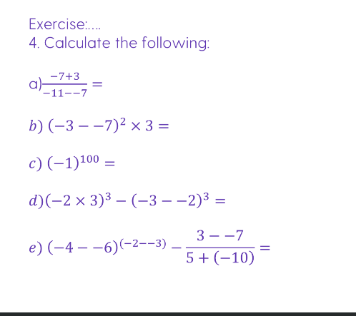

(Umm foundation math go brrr)
- 9x(-3)=?
  (just do 9 x 3 then add a - boy. It is a - because there is a -3)
    - -27
- (-2)x(-3)=?
  (two - therefore it is a positive answer so the answer is 6)
    - 6

## Questions
### 1 (got them all right baby)
- -3 * (-2) = 6
- -12 / 4 (negative baby as there is one minus) = -3
- (-9)2 (the two is a squared number) = 81
- 4 * -13 (negative baby as there is one minus) = -52
- 16 / -2 = -8
- (-30) / (-6) (it is really 30/6 because double - means + math baby) = 5
- -8 * 3 = -24

### 2 (math baby, shit my math failed me)
- (-4)2 / (-2)2 (it will not be minus as there is two - and squaring a number makes it a +) = 64 should be -> 4
- (-3)2 x - 7 = (it will be minus even though there are two - as the squared number turns into a positive so a positive x minus is a minus) = -42 should be -> -63
- 50 / (-5)2 (positive baby because the squared number becomes a postive so you know maths baby) = 2 (correct)
- (1 - - 1) x (2 -- 2) (positive baby do I really have to say why you idot) 8 (correct)
- (-3)3 / (-3)2 = (do you really want me to say it *insert face palm umm it should be a minus) 3

- 5 minutes to do this  umm no
